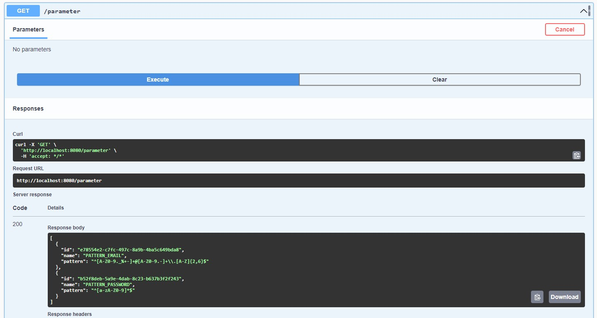
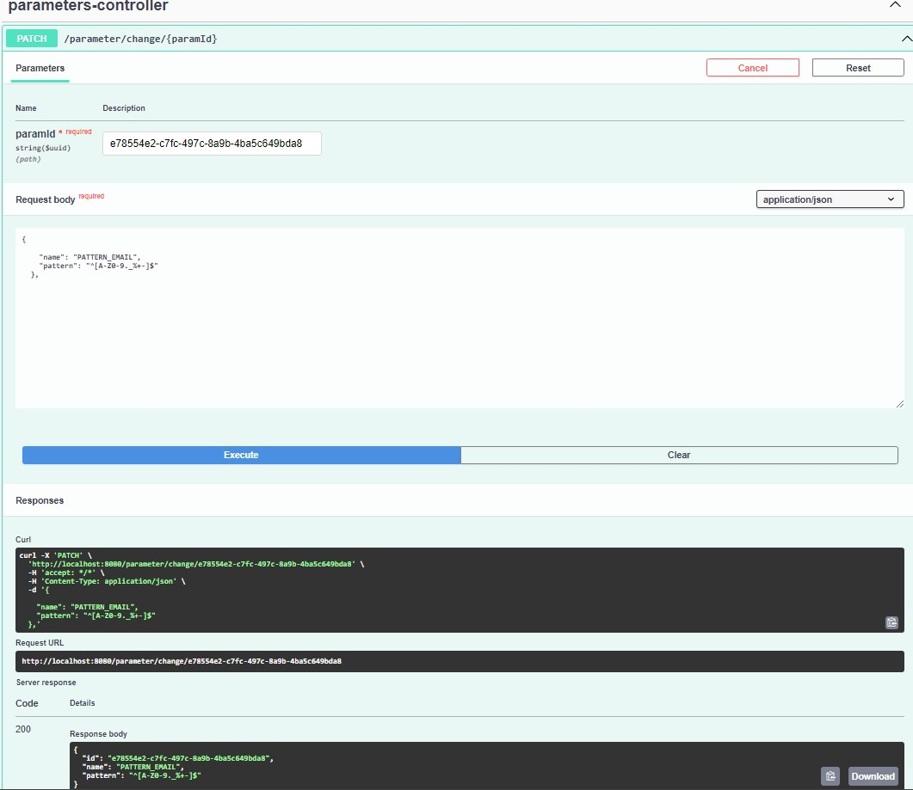
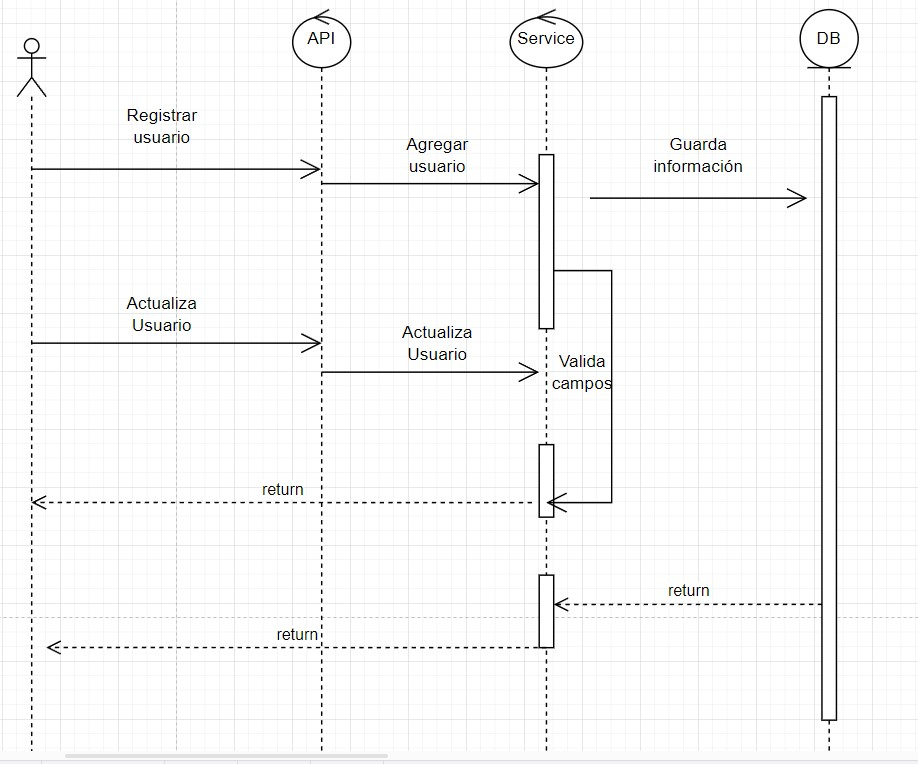
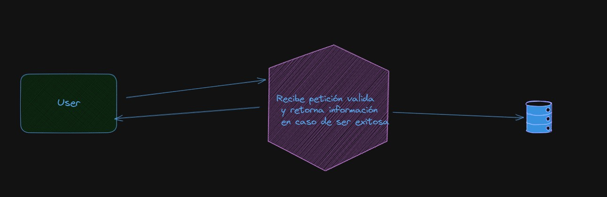

# Prueba técnica Nisum :

## Jose Ramos

**swagger**: http://localhost:8080/swagger-ui/index.html    
**h2**: http://localhost:8080/h2-console/   
sa/password
# Como ejecutar
### via maven
##### situarse en la raiz del proyecto y ejecutar 
     .\mvn spring-boot:run
     .\mvnw spring-boot:run (windows)

Java 17 debe estar instalado y setteado en las variables de entorno

### Via docker-compose
 1) Situarse en la raiz del proyecto
 2) Iniciar sesión en docker 
 3) ejecutar el siguiente commando:
######
     docker-compose up -d    

### Via docker Hub
#### Descargar imagen del repositorio:
    docker pull joseoxi/nisum-prueba-tecnica-jose-ramos
### Configuración de regex email y password
esto se puede hacer mediante  del endpoint:
http://localhost:8080/parameter

### Diagrama

